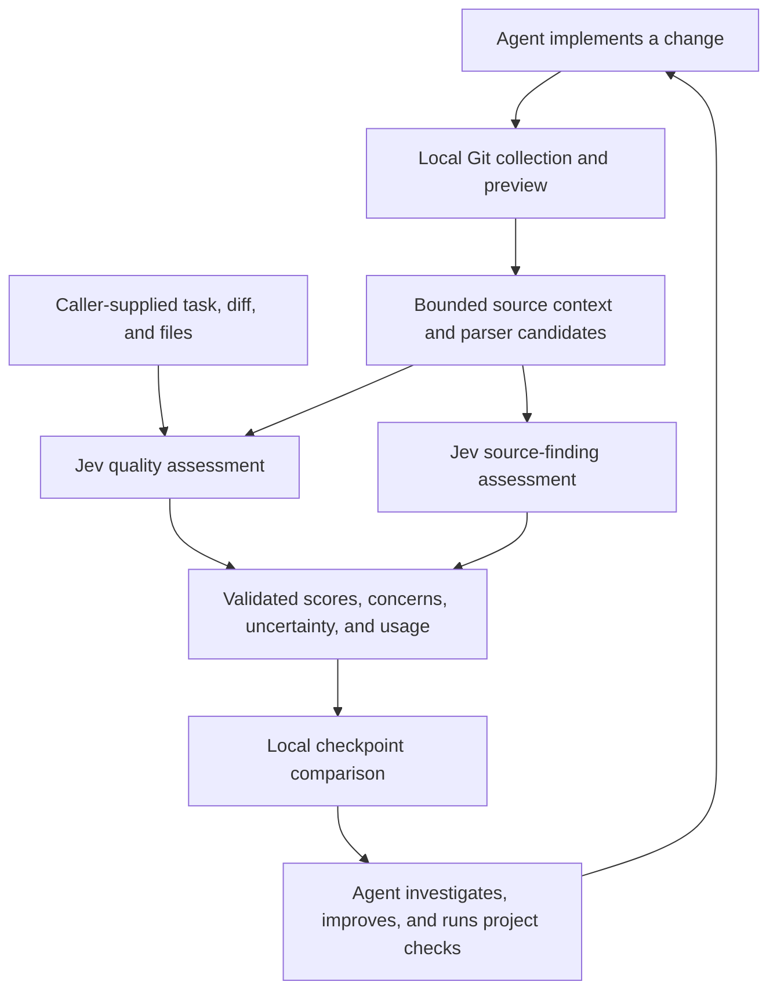

<div align="center">

# Tracecheck

**Continuous code review for AI coding agents, powered by Jev.**

Review 19 quality dimensions, investigate findings at their source, and compare changes as you build.

[](https://typesafe.ai)
[](#mcp-and-agent-setup)
[](package.json)

[Quick start](#quick-start) · [How it works](#how-it-works) · [Agent setup](#mcp-and-agent-setup) · [Quality dimensions](#quality-dimensions) · [Distribution](#distribution) · [Roadmap](#roadmap)

</div>

Tracecheck gives your coding agent structured feedback at implementation checkpoints. It combines a broad assessment of software quality with focused findings tied to exact files, symbols, and lines. Your agent makes the changes; Tracecheck evaluates the supplied evidence and tracks what changed between reviews.

Run it as a **local MCP server** or use the **CLI** directly. Live assessments send code context to TypeSafe using your API key. Tracecheck has no hosted application backend and does not edit or execute the code being reviewed.

> **Status:** Working implementation with automated tests and live Jev/MCP validation. Real-project accuracy calibration, broader source checks, and executable fix verification are in progress or planned. See [validation evidence](docs/validation.md) for what has actually been tested.

## What you get

| Capability | What it provides |
| --- | --- |
| **19 independent quality dimensions** | Applicability, 1–10 scores, confidence, selected concerns, and suggested next steps. No blended overall grade. |
| **Findings tied to source** | Parser-derived locations and code excerpts, with separate support and impact judgments. |
| **Repository context** | Git changes and baseline source, bounded relative-import expansion, and related tests. |
| **Checkpoint comparisons** | Eligible quality deltas and finding history, without treating a missing finding as a verified fix. |
| **Explicit uncertainty** | Missing context, uncertain judgments, and omitted files remain visible. |
| **Agent and CLI workflows** | Three MCP tools, a continuous-review skill, readable terminal output, and JSON reports. |
| **Bounded requests** | Context budgets, provider deadlines and retries, usage accounting, and a short-lived MCP review cache. |

## Why Jev

[Jev](https://typesafe.ai) specializes in focused, typed judgments. Tracecheck uses its three [question primitives](https://docs.typesafe.ai/primitives) to turn a review into decisions that code can validate and compare:

| Primitive | Used for |
| --- | --- |
| **Noul** | Whether a quality dimension is relevant and sufficiently supported by the available context. |
| **Score** | An ordered quality assessment, normalized to a 1–10 scale. |
| **Choice** | Selecting a concern or classifying a source finding's support and potential impact. |

Independent questions can share a request and its source context. Tracecheck sends the broad assessment with the first source-check batch, avoiding a separate upload for those two layers. Typed responses support schema validation, explicit uncertainty, and automated comparisons without parsing a review essay.

The division of work is deliberate: code extracts locations and computes comparisons; Jev supplies semantic judgments; the coding agent decides how to improve the implementation. Jev does not generate patches or prove that a fix works. Its [confidence signals](https://docs.typesafe.ai/confidence) still need calibration against representative review cases.

## Quick start

### Requirements

- **Node.js 22.18 or newer** and npm.
- A Jev API key from the [TypeSafe console](https://console.typesafe.ai) for live assessments.
- Git and a repository with at least one commit for automatic collection. Supplied-context assessment does not require Git.

### Build and configure

Clone and build:

```sh
git clone https://github.com/bmccarn/tracecheck.git
cd tracecheck
npm ci
npm run build

# Set one of these in the environment that launches Tracecheck.
export TYPESAFE_API_KEY="your-key"
# JEV_API_KEY is also supported and takes precedence if both are set.
```

The built `dist/plugin.mjs` includes its runtime dependencies and can run without `node_modules`. Distribution is currently from source. The npm and plugin release artifacts can be built locally; see [distribution](#distribution) for their publication status.

Try the scripted example without an API call:

```sh
npm run demo
```

This demo uses simulated decisions to illustrate source-finding output. For a real assessment, review a repository containing changes:

```sh
# Inspect the files and coverage gaps locally. No API key needed.
node dist/plugin.mjs preview --repo /path/to/repo \
  --task 'Return null for invalid JSON while preserving valid-input behavior'

# Send the collected context to Jev and save the report.
node dist/plugin.mjs review --repo /path/to/repo \
  --task 'Return null for invalid JSON while preserving valid-input behavior' \
  --out .tracecheck/before.json
```

Paths to the runtime above are relative to the Tracecheck checkout. `--repo` selects the repository being reviewed; report paths are relative to your current directory.

By default, collection compares **HEAD with the working tree**, including staged and unstaged tracked changes. Use `--base COMMIT` for another baseline and `--include-untracked` to include supported new files. Already committed changes need an earlier baseline to appear in the review.

## How it works



1. **Collect or supply context.** Use the repository workflow or provide a focused task, diff, files, and relevant project facts directly.
2. **Assess two complementary layers.** The broad layer considers all 19 dimensions. The source layer evaluates specific parser-derived hypotheses where supported.
3. **Validate and qualify the result.** Responses are checked against their expected types. Scores and findings retain confidence, applicability, and coverage limitations.
4. **Compare locally.** Previous assessments are used for comparison, not sent to Jev as evidence about the current implementation.
5. **Act on supported concerns.** Investigate findings, make justified changes, run normal project checks, and review another checkpoint. Avoid changing code solely to raise a score.

For MCP repository reviews, preview produces a snapshot token. Review recollects the context and rejects a mismatched token if code, requirements, or supplied context changed. CLI `review` collects its own current context and does not require a prior preview token.

## Quality dimensions

These 15 dimensions are considered whenever the supplied evidence permits:

| Dimension | Focus |
| --- | --- |
| Correctness | Requirements, edge cases, invariants, and regressions. |
| Cognitive complexity | Control flow, state, and unnecessary indirection. |
| Readability | Names, intent, expression clarity, and explanation. |
| Modularity | Cohesive responsibilities and useful boundaries. |
| Coupling | Dependency direction, hidden inputs, and exposed internals. |
| Changeability | Scattered decisions and cascading edits. |
| Abstraction and API design | Useful interfaces and appropriate generality. |
| Project structure | Discoverability and placement of related behavior. |
| Duplication and reuse | Repeated knowledge and appropriate sharing. |
| Maintainability | Effort to understand, diagnose, and modify code. |
| Testability and test quality | Meaningful assertions, regression protection, and repeatability. |
| Reliability | Failure handling, cleanup, retries, and concurrency. |
| Security | Relevant trust boundaries and exposure. |
| Consistency | Alignment with established project conventions. |
| Documentation | Contracts, usage, and non-obvious decisions. |

Four additional dimensions depend on the problem's context:

| Dimension | Relevant evidence |
| --- | --- |
| Performance | Workload characteristics and cost-sensitive paths. |
| Scalability | Growth requirements and scaling constraints. |
| Compatibility | Existing consumers and compatibility contracts. |
| Observability | Operational needs and diagnostic behavior. |

Insufficient evidence can leave a dimension unscored; uncertainty is not a failing grade. Each dimension has a selected concern, and up to five actionable concerns are prioritized. A high score does not hide an independently actionable concern. These broad signals are distinct from findings with exact source locations.

## Review workflows

### Compare implementation checkpoints

After addressing a concern, run another review with the same task and baseline:

```sh
node dist/plugin.mjs review --repo /path/to/repo \
  --task 'Return null for invalid JSON while preserving valid-input behavior' \
  --previous .tracecheck/before.json --out .tracecheck/after.json

# Compare source-finding identities separately from quality deltas.
node dist/plugin.mjs compare \
  --previous .tracecheck/before.json --current .tracecheck/after.json
```

Keep the baseline fixed across commits by passing the same commit SHA with `--base` to both reviews. Quality comparisons require matching scope, model, and rubric; uncertain pairs do not produce numeric improvement claims. Source history additionally checks repository, baseline, and policy compatibility.

Source findings can be `still_present`, `no_longer_supported`, `unresolved`, or `not_reassessed`. None of these means a fix has been executed and verified.

### Supply context directly

Use `assess` for focused snippets, remote code, non-Git work, or any language. Save this as `context.json`:

```json
{
  "task": "Return null for invalid JSON without changing valid-input behavior.",
  "files": [
    {
      "path": "src/decode.py",
      "content": "import json\n\ndef decode(value):\n    return json.loads(value)\n"
    }
  ],
  "repositoryContext": "The caller expects invalid JSON to produce None rather than an exception.",
  "scope": "example/decode"
}
```

```sh
node dist/plugin.mjs assess --input context.json --out quality-before.json

# After updating the supplied source:
node dist/plugin.mjs assess --input revised-context.json \
  --previous quality-before.json --out quality-after.json
```

A `diff` string is also supported. At least one current context field is required. Use a stable `scope` to identify the same review subject across checkpoints. `assess` evaluates only what you provide and performs no repository reads or parser-based source checks.

### CLI options and exit codes

| Option | Purpose |
| --- | --- |
| `--repo PATH` | Repository to collect; CLI preview/review default to the current directory. |
| `--base REF` | Git baseline; defaults to `HEAD`. |
| `--include-untracked` | Include supported, non-ignored untracked files. |
| `--task TEXT` | Requested behavior or acceptance criteria. |
| `--context TEXT` | Relevant repository facts, contracts, or observed test results. |
| `--json` | Emit full JSON for preview, review, or assess. |
| `--out FILE` | Save a review report or quality assessment as JSON. |
| `--previous FILE` | Previous repository report for review; previous quality assessment for assess. |

Repository `review` uses these exit codes:

| Code | Meaning |
| --- | --- |
| `0` | No actionable concerns in the performed review. |
| `1` | Concerns need investigation. |
| `2` | Execution or input error. |
| `3` | Inconclusive because of uncertainty or coverage gaps. |

A zero exit does not prove correctness. `assess` returns quality signals without a score-based failure gate. Use `--help` for command syntax.

## Install the plugin

After exporting your TypeSafe API key, install from GitHub.

**Claude Code**

```text
/plugin marketplace add bmccarn/tracecheck
/plugin install tracecheck@tracecheck-plugins
```

Invoke `/tracecheck:tracecheck` to start the review workflow.

**Codex**

```sh
codex plugin marketplace add bmccarn/tracecheck
```

Select the Tracecheck marketplace in the Plugins directory and install Tracecheck. Start a new task and ask to use its skill. Both installations require Node.js 22.18+ and a Jev key in the launching environment.

## MCP and agent setup

Tracecheck uses the **MCP v2 SDK over stdio** and exposes three tools:

| Tool | Input and behavior |
| --- | --- |
| `tracecheck_preview` | Collect a repository locally and return its manifest, limitations, candidate count, and snapshot token. |
| `tracecheck_review` | Review that snapshot with Jev; optionally compare a supplied `previousEvaluation`. |
| `tracecheck_assess` | Assess caller-supplied context in any language, with optional previous-evaluation comparison. |

Configure your MCP client with:

| Setting | Value |
| --- | --- |
| Command | `node` |
| Arguments | `/absolute/path/to/tracecheck/dist/plugin.mjs`, `mcp` |
| Environment | Forward `TYPESAFE_API_KEY` or `JEV_API_KEY`; optionally `JEV_MODEL`. |

Append `--repo`, `/absolute/path/to/reviewed/repo` to bind the server to one repository. Otherwise, collection-tool calls must provide `repo`. GUI applications may not inherit variables exported in `.zshrc`; use your client's environment configuration.

The package includes portable plugin manifests, Codex and Claude compatibility adapters, and a [continuous-review skill](skills/tracecheck/SKILL.md). Follow the [installation and integration guide](docs/integrations.md) for local plugin installation. The skill supplies the review cadence; adding the MCP server alone only exposes its tools.

A useful first instruction to your agent:

> Use Tracecheck after each coherent implementation change. Supply the requirements and relevant contracts, investigate actionable concerns, run the project's checks, and compare the next checkpoint. Report uncertainty and missing coverage. Do not refactor solely to improve scores.

MCP protocol and packaging have been validated; installation in every native client has not. The standalone bundle needs Node.js, but no separate runtime dependency installation.

## Distribution

Tracecheck packages the MCP server and review skill together for Claude Code and Codex. The same standalone runtime also provides the npm CLI.

```sh
npm run package:check
```

This builds and verifies an npm tarball and a marketplace bundle for both clients in `release/`. The packaged CLI and MCP handshake are tested through offline `npm exec`, outside the checkout.

After npm publication, the intended command is `npx --yes @bmccarn/tracecheck@0.2.0 mcp` (or `preview`, `review`, and `assess`). **The package is not published yet.** An `npx` MCP configuration exposes tools; install the plugin to register the associated skill as well.

See the [publishing guide](docs/publishing.md) for local artifact testing, Claude/Codex installation, registry publication, and version updates.

## Configuration and data handling

| Environment variable | Default | Purpose |
| --- | --- | --- |
| `TYPESAFE_API_KEY` | Required unless `JEV_API_KEY` is set | TypeSafe authentication. |
| `JEV_API_KEY` | Unset | Alternative key name; takes precedence. |
| `JEV_MODEL` | `jev-latest` | Model selection. Use an available concrete version for repeatable evaluations. |

Tracecheck does not load `.env` files automatically or persist your API key. Review requests are authenticated directly to the [TypeSafe API](https://docs.typesafe.ai/api). The selected source, baseline versions, dependencies, tests, and supplied task/context may leave your machine during live assessment. Local execution is not offline inference.

- `preview` is local. `preview --json` shows the captured source as well as the collection metadata.
- The collector skips generated paths, symlinks, binary files, and some recognizable secret patterns. This is not comprehensive secret detection; manually supplied context does not pass through that collector screening.
- Saved reports contain code excerpts and repository metadata. Treat them as source-bearing artifacts. This checkout ignores `.tracecheck/` and `.env` files.
- Repository review results are cached in the MCP process for up to five minutes, with at most 16 entries. Cache hits retain the original timestamp and include an explicit cache flag. This cache does not apply to CLI runs or supplied-context assessments.

### Collection limits

| Limit | Current value |
| --- | --- |
| Collected files | 16 |
| Current file size | 24,000 bytes |
| Total source context, including baseline versions | 60,000 characters |
| Parser-derived source candidates | 40 |
| Serialized provider request | Less than 180,000 bytes |

Collection omissions are reported. An oversized provider request fails visibly. Automatic dependency expansion follows one hop of supported relative JS/TS imports and selected related tests; it is not a complete call graph.

## Coverage and validation

The broad assessment accepts code in any language, but that is not a claim of equal accuracy across languages. Automatic collection supports common source, configuration, and documentation extensions. Exact parser-derived findings currently cover **JS/TS division or remainder boundaries, swallowed failures, and JSON parsing boundaries**. A matching syntax pattern is a hypothesis for Jev to assess, not an automatic bug report.

```sh
npm run validate                    # Type checks, tests, and builds
npm run demo                        # Scripted example; no live inference
npm run benchmark -- --live          # Six synthetic source-check cases
npm run smoke -- --live              # Live MCP review and cache verification
npm run quality-smoke -- --live      # Live supplied-context Python assessments
```

Live commands require credentials and consume API usage. The [validation record](docs/validation.md) documents automated checks, observed live results, and their limits. The small synthetic benchmark is a smoke test, not a general accuracy estimate. Tracecheck does not currently run tests, reproduce failures, or verify fixes by execution.

## Troubleshooting

| Symptom | What to check |
| --- | --- |
| Missing API key | Export a supported variable in the launching process. For GUI clients, configure its environment explicitly. |
| No changed files | The default baseline is `HEAD`. Select an earlier commit for committed changes; opt in to untracked files when needed. |
| Snapshot mismatch | Preview again and use the same repository, baseline, task, and context for review. |
| Missing scores or inconclusive result | Read applicability and coverage limitations. Provide the missing contracts, callers, or tests rather than treating uncertainty as a defect. |
| Comparison skipped or rejected | Keep scope, baseline, model, and rubric/policies consistent; use the correct report type for the command. |
| Context limit error | Narrow the diff or supplied files and remove unrelated context. |

## Roadmap

The next milestone focuses on review quality and reliability:

- Representative bug/clean/fix benchmarks and calibrated thresholds.
- Separate relevance, evidence sufficiency, and concern-support judgments.
- Focused evidence packets with better caller, contract, and test retrieval.
- Stronger cache isolation, request budgets, and cancellation boundaries.

Later work includes broader source checks, incremental reassessment, isolated reproductions and fix verification, and CI/SARIF exports. These are planned capabilities, not current features.

## Development

Run `npm ci` and `npm run validate` before submitting implementation changes. A useful bug report includes a minimal reproducible fixture, expected behavior, actual report, and relevant model/version information; remove credentials and private source first.

| Location | Purpose |
| --- | --- |
| [`src/collector.ts`](src/collector.ts) and [`src/checks.ts`](src/checks.ts) | Git context and parser-derived candidates. |
| [`src/jev.ts`](src/jev.ts) | Typed provider requests, validation, and retry handling. |
| [`src/quality.ts`](src/quality.ts) and [`src/quality/`](src/quality/) | Dimension assessment and quality comparisons. |
| [`src/review.ts`](src/review.ts) and [`src/history.ts`](src/history.ts) | Review orchestration, rendering, and source-finding history. |
| [`src/mcp.ts`](src/mcp.ts) and [`src/cli.ts`](src/cli.ts) | MCP tools and command-line entry points. |
| [`test/`](test/) and [`examples/`](examples/) | Regression tests, demos, and live smoke checks. |

Further reading: [Design](docs/design.md) · [Integrations](docs/integrations.md) · [Validation](docs/validation.md) · [Capability coverage](docs/parity.md)

## License

[MIT](LICENSE).
